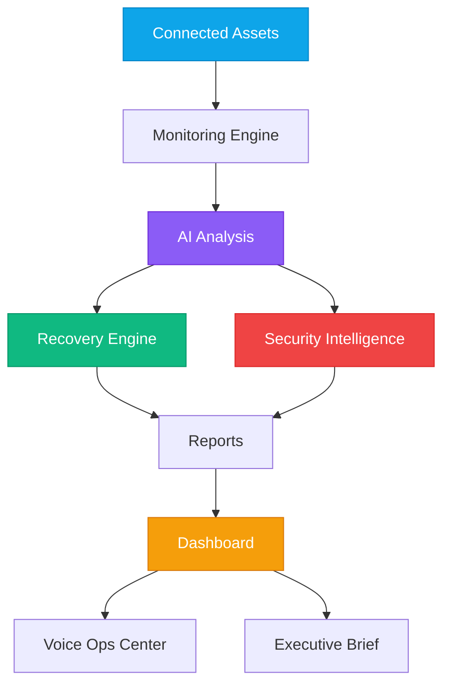
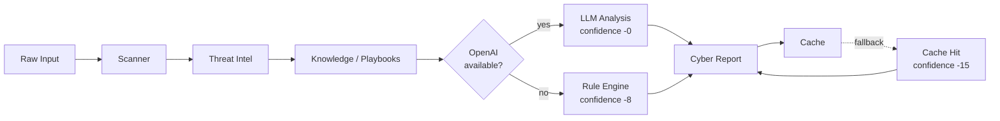
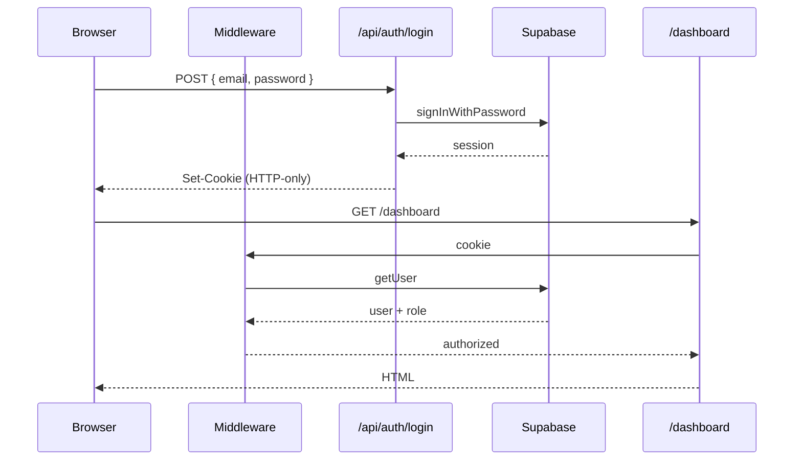

<div align="center">

# 🛡️ PulseGuard AI

### **An AI-powered self-healing cybersecurity and resilience platform that detects, analyzes, and recovers from failures autonomously.**

[](https://nextjs.org/)
[](https://www.typescriptlang.org/)
[](https://tailwindcss.com/)
[](https://supabase.com/)
[](https://platform.openai.com/)
[](#deployment)
[](#license)

[**Live Demo**](#demo-scenario) · [**Quick Start**](#installation) · [**Architecture**](#architecture) · [**Roadmap**](#future-roadmap) · [**Contributing**](#contributing)

</div>

---

## Overview

**PulseGuard AI** is a production-grade, AI-native operations console that turns reactive incident response into autonomous resilience. It unifies **AI-powered incident analysis**, **security intelligence**, **self-healing recovery**, **chaos engineering**, **resilience testing**, a **voice operations center**, and **temporal incident memory** into a single, beautifully designed experience.

What makes it different: **PulseGuard keeps working when its own components fail.** Every dependency — the LLM, the vector knowledge base, the scanner, the threat intel feed, the analysis queue — has a deterministic fallback path. Disable any of them in the Chaos Center and the system gracefully degrades through an explicit `ai → rules → cache → partial` chain, always returning a complete, actionable report.

PulseGuard is designed to be **demo-ready in 30 seconds** (no env vars required) and **production-ready when you are** (drop in Supabase + OpenAI keys, run one SQL file, redeploy).

---

## Problem Statement

Modern organizations depend on a fragile mesh of APIs, databases, cloud services, third-party SaaS, and applications. When something goes wrong:

- 📉 **Downtime increases** while engineers paste log lines into chat
- 💸 **Revenue is lost** — every minute of payment-API failure costs real money
- 👀 **Engineers manually investigate** dashboards, traces, and runbooks under pressure
- 🔓 **Security threats go unnoticed** because alert fatigue buries the real signal
- ⏱️ **Recovery takes too long** because diagnosis, decision, and action are three separate humans on three separate tools

Traditional monitoring tools (Datadog, New Relic, PagerDuty, Splunk) **alert users**. They do not:

- Explain **what** is happening in plain English
- Recommend **how** to fix it
- Recover **automatically**, with audit trails and approvals
- Continue functioning when their own dependencies fail

PulseGuard AI solves all four.

---

## Solution

PulseGuard wraps the entire incident lifecycle in a single autonomous loop:

```
        ┌──────────────────┐
        │ Connected Assets │
        └────────┬─────────┘
                 ▼
        ┌──────────────────┐
        │ Monitoring &     │
        │ Anomaly Detection│
        └────────┬─────────┘
                 ▼
        ┌──────────────────┐
        │ AI Root Cause &  │
        │ Severity Scoring │
        └────────┬─────────┘
                 ▼
        ┌──────────────────┐
        │ Recovery         │
        │ Recommendations  │
        └────────┬─────────┘
                 ▼
        ┌──────────────────┐
        │ Autonomous       │
        │ Recovery Actions │
        └────────┬─────────┘
                 ▼
        ┌──────────────────┐
        │ Reports &        │
        │ Executive Brief  │
        └──────────────────┘
```

### Resilience by design

Every layer has a fallback. The Cyber Analyzer demonstrates the full chain:

| Stage      | When it fires                                    | What it does                                                |
| ---------- | ------------------------------------------------ | ----------------------------------------------------------- |
| **ai**     | `OPENAI_API_KEY` set and LLM component online    | gpt-4o-mini structured analysis with rich narrative         |
| **rules**  | LLM unavailable or API call failed               | Deterministic analyzer using simulated recon + threat intel |
| **cache**  | Rules path failed but a previous report exists   | Returns last-known-good analysis with confidence penalty    |
| **partial**| Everything else failed                           | Returns a graceful minimum-viable report with explicit gap notes |

Confidence scores reflect the path taken. Reports are **never empty**.

---

## Core Features

### 🧠 AI Incident Analyzer
- **Root-cause analysis** via gpt-4o-mini or deterministic rule engine
- **Severity scoring** (`low / medium / high / critical`) derived from scan findings + reputation thresholds (80 / 60 / 35)
- **Business-impact estimation** with cost-per-minute mapping per service
- **Confidence scores** (0–100) that penalize degraded paths

### 🛡️ Security Intelligence
- **Threat scoring** for every asset, blended from scanner findings & reputation
- **MITRE ATT&CK** technique mapping (12 baked-in techniques, e.g. T1110, T1059)
- **CVE lookups** including high-profile CVEs (xz, HTTP/2 Rapid Reset, regreSSHion)
- **Threat feed** built live from incidents + cyber reports with citation IDs

### 🔁 Self-Healing Recovery
- **Automatic recovery workflows** with explicit stages: `detected → analyzing → recovering → resolved`
- **Recovery recommendations** ranked by priority and confidence
- **Recovery timeline** rendered with active/done/pending states
- **MTTR & MTTD** computed continuously from incident history

### 💥 Chaos Engineering
- **One-click failure injection**: disable the LLM, scanner, vector DB, threat intel, or queue
- **Scripted disaster scenarios**: 4-step API failure demo with voice narration
- **Real-time resilience score** that drops as components fail and recovers as they restore
- **Validates self-healing**: every chaos action proves the fallback path

### 🎙️ Voice Operations Center
- Browser **SpeechSynthesis** narrates the full incident lifecycle
- **Mute toggle + volume slider** in the topbar
- **Text fallback** via on-page toast if the browser blocks speech
- Preferred voice selection (Google US English, Samantha, Microsoft Aria)

### 🧠 Temporal Incident Memory
- **Historical incident tracking** with searchable timeline
- **Pattern detection** (`findPatterns`) — groups incidents by type + service
- **Next-failure prediction** (`predictNextFailure`) ranks recurring services by recency
- **Trend analysis** drives the executive risk dashboard's 7-day resilience curve

### 📋 Reporting Engine
- **Incident reports** with diagnosis, business impact, executive summary
- **Security reports** with MITRE & CVE annotations
- **Recovery reports** with stages, durations, and confidence
- **PDF export** via `jsPDF` + Markdown / JSON via `/api/reports/generate`

### 📊 Real-Time Dashboard
- **Live metrics** (CPU / memory / network / database / API) updated every 1.5 s
- **Executive risk panel** with cost, MTTR, MTTD, resilience trend
- **Component health grid** with degraded/offline visualisation
- **AI SRE Agent report** as the dashboard hero card
- **Recovery timeline + status** side-by-side

### 🔐 Enterprise Authentication & RBAC
- **Email/password auth** via Supabase + `@supabase/ssr` (cookie-based)
- **Three roles**: `admin · engineer · viewer`
- **Three-layer enforcement**: middleware redirects + API route guards + Postgres RLS
- **Demo mode** with localStorage session for zero-config evaluation

### 🩺 System Check Console
- Full diagnostic page at `/system-check`
- Environment variables, Supabase reachability, OpenAI key, voice support — all live-checked
- **"Run Full System Test"** button exercises 10 critical paths sequentially
- Feature readiness checklist tells judges exactly what works and how to use it

---

## Architecture

### High-level system diagram



### Resilience fallback chain



### Authentication flow (production)



---

## Tech Stack

| Layer | Technologies |
|------|--------------|
| **Frontend** | Next.js 15 (App Router), React 19, TypeScript 5, TailwindCSS 3, ShadCN-style UI, Framer Motion 11, Recharts, Lucide icons |
| **State** | Zustand 4 (single store, derived selectors) |
| **Backend** | Next.js Route Handlers (Node.js runtime) |
| **Database** | Supabase Postgres + Row-Level Security |
| **Auth** | Supabase Auth via `@supabase/ssr` (HTTP-only cookies) |
| **AI** | OpenAI `gpt-4o-mini` with deterministic rule-engine fallback |
| **Voice** | Browser Web Speech API (`SpeechSynthesis`) |
| **PDF** | jsPDF |
| **Diagrams** | Mermaid (rendered by GitHub) |
| **Deployment** | Vercel · Render · any Node host |

---

## Project Structure

```
pulseguard-ai/
├─ src/
│  ├─ app/                          # Next.js App Router pages
│  │  ├─ page.tsx                   # Public landing page
│  │  ├─ login/ · signup/           # Auth pages (Suspense-wrapped)
│  │  ├─ dashboard/                 # Operator console
│  │  ├─ analyzer/ · chaos/         # Incident analyzer · Chaos Center
│  │  ├─ copilot/ · executive/      # AI copilot · Exec dashboard
│  │  ├─ autonomous/ · replay/      # Autonomous actions · Disaster replay
│  │  ├─ incidents/ · recovery/     # Incident list · Recovery view
│  │  ├─ security/ · intelligence/  # Security center · MITRE/CVE intel
│  │  ├─ reports/ · settings/       # Reports (PDF) · Settings
│  │  ├─ system-check/              # Judge-facing diagnostic console
│  │  └─ api/                       # 17 Route Handlers (see below)
│  ├─ components/
│  │  ├─ auth/                      # AuthShell · LoginForm · SignupForm · UserMenu
│  │  ├─ layout/                    # AppShell · Sidebar · Topbar · PageHeader
│  │  └─ ui/                        # Button · Card · Badge · Input · Toast · …
│  ├─ features/                     # Domain-specific UI modules
│  │  ├─ dashboard/ · executive/
│  │  ├─ incidents/ · recovery/
│  │  ├─ cyber/ · chaos/
│  │  ├─ copilot/ · autonomous/
│  │  ├─ replay/ · memory/
│  │  ├─ security/ · security-map/
│  │  ├─ threat-intel/ · intelligence/
│  │  ├─ recommendations/ · reports/
│  │  ├─ metrics/ · simulation/
│  │  ├─ voice/ · ai-investigator/
│  ├─ services/                     # Pure business logic
│  │  ├─ ai.ts · sre-agent.ts       # AI analyzers
│  │  ├─ incident.ts · resilience.ts# Incident factory · breaker + retry
│  │  ├─ cyber-analyzer.ts          # Master fallback orchestrator
│  │  ├─ scanner.ts · threat-intel.ts · knowledge.ts
│  │  ├─ mitre.ts · threat-feed.ts  # MITRE / CVE
│  │  ├─ business-risk.ts · predictor.ts · recommendations.ts
│  │  ├─ copilot.ts · replay.ts
│  ├─ hooks/                        # useMetrics · useVoice
│  ├─ lib/
│  │  ├─ auth-context.tsx           # Client AuthProvider + useAuth()
│  │  ├─ api-auth.ts                # guardApi() route gate
│  │  ├─ store.ts                   # Zustand operator state
│  │  ├─ constants.ts · utils.ts
│  │  └─ supabase/                  # client · server · middleware · helpers
│  ├─ types/                        # Shared TypeScript types
│  └─ middleware.ts                 # Route-level auth gate
├─ supabase/
│  └─ schema.sql                    # profiles + incidents + RLS + trigger
├─ scripts/
│  └─ seed-demo-users.mjs           # Idempotent demo account seeder
├─ public/                          # Static assets
├─ README.md
├─ package.json · tsconfig.json · next.config.ts · tailwind.config.ts
└─ .env.local                       # (created by you — see below)
```

### API surface (17 endpoints)

| Endpoint | Method | Purpose |
|---|---|---|
| `/api/health` | GET | Liveness probe |
| `/api/system-check` | GET | Aggregate diagnostic |
| `/api/auth/login` · `/signup` · `/logout` · `/profile` | POST · GET | Authentication |
| `/api/incidents/create` · `/list` | POST · GET | Incident CRUD |
| `/api/analyze` · `/agent` | POST | AI incident analyzers (LLM → fallback) |
| `/api/cyber/analyze` | POST | Cyber report orchestrator (admin/engineer) |
| `/api/fallback-analysis` | POST | Forces deterministic path (proves offline mode) |
| `/api/chaos` | POST | Chaos command validator (admin/engineer) |
| `/api/reports/generate` | POST | Markdown / JSON report from state |
| `/api/demo/reset` | POST | Reset signal for client state |

---

## Installation

### 1. Clone the repository

```bash
git clone <repo-url>
cd pulseguard-ai
```

### 2. Install dependencies

```bash
npm install
```

### 3. Configure environment (optional)

PulseGuard runs **fully in demo mode without any environment variables**. To enable real authentication and persistence, create `.env.local`:

```env
# --- Supabase (optional — enables real auth & persistence) ----------------
NEXT_PUBLIC_SUPABASE_URL=https://<project-ref>.supabase.co
NEXT_PUBLIC_SUPABASE_ANON_KEY=<anon-key>

# --- Server-only — used by `npm run seed:users`. NEVER prefix NEXT_PUBLIC_.
SUPABASE_SERVICE_ROLE_KEY=<service-role-key>

# --- OpenAI (optional — enables LLM analysis; rule engine is the fallback)
OPENAI_API_KEY=

# --- Public site URL (used for auth email redirects) ----------------------
NEXT_PUBLIC_SITE_URL=http://localhost:3000
NEXT_PUBLIC_APP_URL=http://localhost:3000
```

### 4. Run the development server

```bash
npm run dev
```

Open <http://localhost:3000>. The landing page appears. Click **Sign in** → tap the `admin@pulseguard.ai` chip → **Sign in**. You're inside the console.

### 5. (Optional) Enable Supabase

When you're ready for real persistence:

```bash
# 1. Run the schema in your Supabase SQL editor
# (open supabase/schema.sql, copy, paste, run)

# 2. Seed demo accounts
npm run seed:users   # creates admin@ / engineer@ / viewer@pulseguard.ai
```

The app **auto-detects** whether Supabase is configured. No code changes required.

---

## Local Development

### Available commands

```bash
npm run dev        # Start dev server on http://localhost:3000
npm run build      # Production build (31 routes, ~38 s)
npm run start      # Run production server
npm run lint       # ESLint with Next.js + TS rules
npm run seed:users # Create the three demo Supabase accounts
```

### Day-to-day workflow

| Task                       | Where to go                                     | What you'll do                                               |
| -------------------------- | ----------------------------------------------- | ------------------------------------------------------------ |
| Add an asset / incident    | `/dashboard` → **Simulation Center**            | Click an incident type to trigger the full AI lifecycle      |
| Run a health check         | `/system-check` → **Run Full System Test**      | 10 sequential checks with per-step pass/fail/timing          |
| Run AI analysis            | `/analyzer`                                     | Paste a domain/IP/log/JSON/NL → **Run Safe Analysis**        |
| Trigger chaos              | `/chaos`                                        | Disable individual components and watch the fallbacks engage |
| Generate a report          | `/reports` (UI) or `POST /api/reports/generate` | PDF, Markdown, or JSON                                       |
| Inspect protected route    | Sign out then visit `/dashboard`                | Middleware redirects you to `/login?redirect=/dashboard`     |

### Hot reloading & state

State lives in a single Zustand store at [src/lib/store.ts](src/lib/store.ts). On HMR the store persists, so chaos toggles, voice queue, incidents, and reports survive code reloads.

---

## Demo Scenario

A complete, judge-ready walkthrough — runs in **under 2 minutes**, requires **zero configuration**.

### 1. **Sign in**
Navigate to <http://localhost:3000/login>. Tap the **`admin@pulseguard.ai`** chip (auto-fills email + password). Click **Sign in**. You land on `/dashboard`.

### 2. **Verify the system**
Open `/system-check` from the sidebar. Click **Run Full System Test**. Watch 10 checks pass in sequence (auth · DB read · incident creation · AI diagnosis · rule fallback · chaos · report · voice · metrics · protected route). Each check shows a duration in milliseconds.

### 3. **Run a health check**
Back on `/dashboard`, the **Live Metrics Panel** is already updating every 1.5 s. The **AI SRE Report** card shows the current system state.

### 4. **Simulate an API failure**
Top-right of the topbar: click **Run Disaster Scenario**. PulseGuard:
- Speaks: _"Initiating disaster recovery simulation."_
- Detects a Payment API failure
- The AI SRE Agent diagnoses root cause + business impact
- Recovery starts → progresses → resolves
- All four stages animate live across **Recovery Timeline** and **Recovery Status**

### 5. **Trigger chaos**
Open `/chaos`. Click the **LLM Analyzer** toggle to disable it. Now go to `/analyzer`, click the **Domain** sample chip, hit **Run Safe Analysis**. The report comes back with `source: "rules"` and a slightly lower confidence — proving the deterministic fallback works.

### 6. **Generate a report**
Open `/reports`. Click **Export PDF** on any incident. Or call `POST /api/reports/generate` with your current state for Markdown / JSON.

### 7. **Review with leadership**
Open `/executive`. The dashboard shows mean-time-to-recovery, mean-time-to-detect, business-cost-per-minute, and a 7-day resilience trend — all derived from real state, no mocks.

---

## Deployment

### Deploy to Vercel

1. **Push to GitHub**
   ```bash
   git push origin main
   ```
2. **Import the project** at <https://vercel.com/new>.
3. **Add environment variables** (Project Settings → Environment Variables):
   ```
   NEXT_PUBLIC_SUPABASE_URL
   NEXT_PUBLIC_SUPABASE_ANON_KEY
   SUPABASE_SERVICE_ROLE_KEY    (server-only)
   OPENAI_API_KEY               (optional)
   NEXT_PUBLIC_SITE_URL
   NEXT_PUBLIC_APP_URL
   ```
4. **Deploy.** Vercel auto-detects Next.js — no config needed.
5. **Verify**: visit `https://<your-app>.vercel.app/system-check`.

### Deploy to Render

1. Create a new **Web Service** from this repo.
2. **Build command**: `npm install && npm run build`
3. **Start command**: `npm run start`
4. Add the same env vars in **Environment**.
5. Hit `/api/health` to confirm.

### Behavior after deployment

- 🟢 **With Supabase configured** — login enforces real credentials, signup persists rows, middleware gates protected routes, RLS protects the database.
- 🟡 **Without Supabase** — `/system-check` reports demo mode; any credentials work; localStorage holds the session; the app remains fully usable.
- 🤖 **With `OPENAI_API_KEY`** — AI analyses use gpt-4o-mini.
- 🛟 **Without `OPENAI_API_KEY`** — the deterministic rule engine runs. Reports are still complete.

---

## Security Notes

PulseGuard is a **defensive** platform. By design:

- ❌ **No offensive actions** — the scanner is fully simulated (`simulatedScan`), the threat intel is simulated, no outbound packets are emitted.
- ✅ **Safe-by-default recon** — every "scan" is a deterministic pseudo-random simulation seeded from the input. Reproducible, auditable, side-effect free.
- ✅ **Input validation** at the API boundary: email regex, password strength (≥ 8 chars + upper + lower + digit), role allow-listing, JSON schema checks.
- ✅ **Environment variables for secrets** — `SUPABASE_SERVICE_ROLE_KEY` and `OPENAI_API_KEY` are server-only. Only `NEXT_PUBLIC_*` is bundled to the browser.
- ✅ **HTTP-only secure cookies** for sessions — immune to XSS token theft.
- ✅ **Row-Level Security** at the database — admin/engineer/viewer roles enforced in Postgres, not just in the UI.
- ✅ **No hardcoded credentials** — even the demo seeder accepts `DEMO_PASSWORD` env override.
- ✅ **API route guards** (`guardApi`) wrap every protected endpoint with role-based access control.
- ✅ **CSP-friendly** — no `dangerouslySetInnerHTML`, no inline scripts beyond Next.js defaults.

---

## Future Roadmap

PulseGuard is intentionally simple today so the resilience model is easy to read. Next on the runway:

- 🌐 **Multi-agent orchestration** — split the AI SRE Agent into specialist agents (Triage, Diagnosis, Remediation, Communication) coordinated by a planner
- 🔄 **LangGraph workflows** — replace the ad-hoc fallback chain with a typed, observable state machine
- 📚 **Agentic RAG** — index runbooks, postmortems, and Slack history; retrieve grounded citations per incident
- 🛰️ **Threat intelligence integrations** — VirusTotal · AbuseIPDB · Shodan · OTX · AlienVault
- 💬 **Slack alerts** — interactive `@pulseguard` bot with approve / dismiss actions
- 👥 **Microsoft Teams alerts** — adaptive cards with incident summaries
- 🏢 **Multi-tenant workspaces** — per-organization data isolation, custom branding
- 🧪 **Advanced resilience testing** — scheduled chaos experiments, blast-radius analysis, automatic rollback validation
- 🎙️ **Voice-driven incident commander** — speech-to-text input, hands-free triage
- 📈 **Cost-aware autoscaling recommendations** — link MTTR/MTTD to spend optimization
- 🔍 **Distributed tracing ingestion** — OpenTelemetry plug-in for real-asset wiring

---

## Contributing

Contributions are warmly welcomed. PulseGuard follows a **lightweight, opinionated** workflow:

1. **Fork** the repository and create a feature branch:
   ```bash
   git checkout -b feat/your-feature-name
   ```
2. **Install** and verify the baseline:
   ```bash
   npm install
   npm run build   # must be green (31 routes)
   npm run lint    # must be clean
   ```
3. **Code with the grain**:
   - Keep services pure (no React imports in `src/services/`)
   - Add types to [src/types/index.ts](src/types/index.ts) — no `any`
   - Wire state into the existing Zustand store rather than adding new stores
   - Every API route must return JSON and use `guardApi()` if protected
4. **Test locally**:
   - Add or update the relevant feature card on `/system-check`
   - Run **"Run Full System Test"** — all 10 checks should still pass
5. **Open a PR** with:
   - A clear description and motivation
   - Screenshots / screen recordings for any UI change
   - Notes on resilience: how does your feature degrade when its dependencies fail?

### Code style

- TypeScript strict mode, ESLint with Next.js rules
- Tailwind utility classes — no CSS-in-JS
- Components in PascalCase, hooks in `useCamelCase`, files in kebab-case
- Pure functions over classes wherever practical

### Reporting issues

Please use GitHub Issues. Include:
- Repro steps
- Expected vs. actual behavior
- Output of `/system-check` (screenshot is fine)
- Browser / OS / Node version

---

## Acknowledgements

PulseGuard's visual language draws inspiration from **Linear**, **Vercel**, **Datadog**, and **Google Cloud Security Command Center**. The resilience model is influenced by **Netflix's Chaos Monkey** philosophy and the **circuit-breaker pattern** popularized by Michael Nygard's _Release It!_.

---

## License

```
MIT License

Copyright (c) 2026 PulseGuard AI contributors

Permission is hereby granted, free of charge, to any person obtaining a copy
of this software and associated documentation files (the "Software"), to deal
in the Software without restriction, including without limitation the rights
to use, copy, modify, merge, publish, distribute, sublicense, and/or sell
copies of the Software, and to permit persons to whom the Software is
furnished to do so, subject to the following conditions:

The above copyright notice and this permission notice shall be included in
all copies or substantial portions of the Software.

THE SOFTWARE IS PROVIDED "AS IS", WITHOUT WARRANTY OF ANY KIND.
```

---

<div align="center">

**Built with ❤️ for resilient systems.**

[⬆ Back to top](#-pulseguard-ai)

</div>
