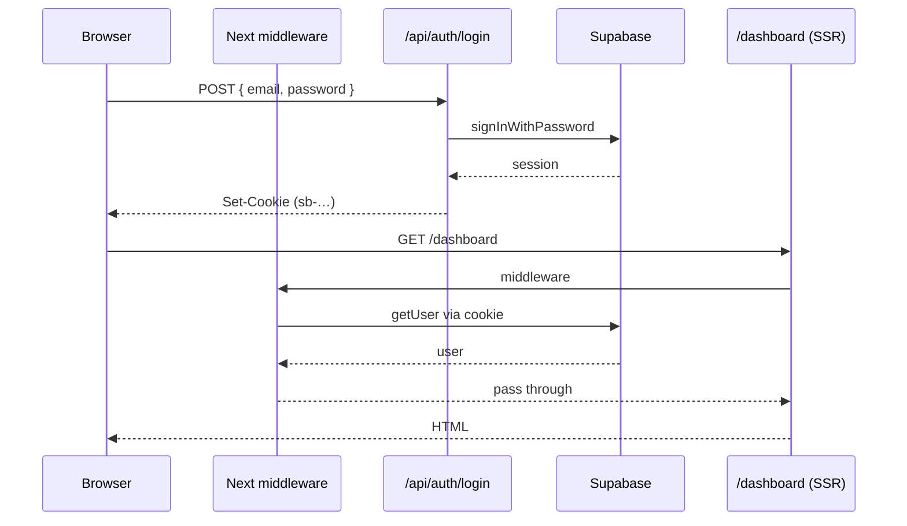
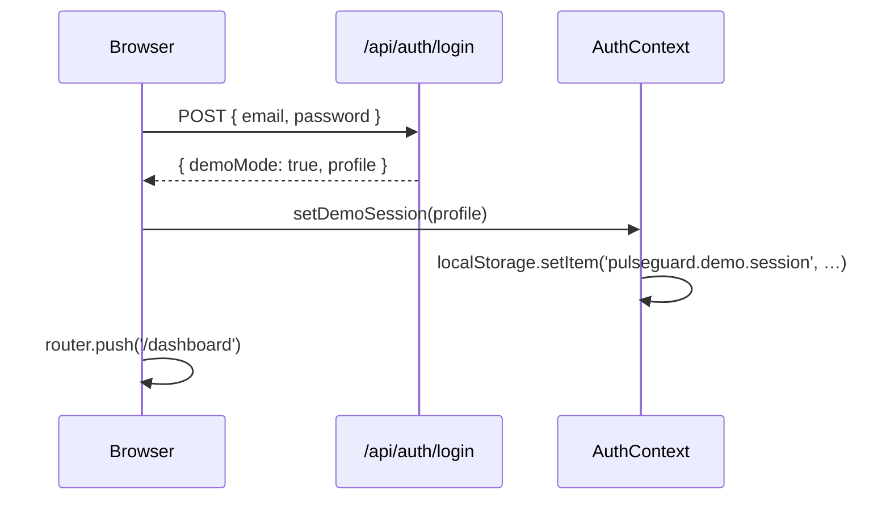

# PulseGuard Cyber AI

> AI-powered **self-healing cybersecurity infrastructure**. Detects threats, diagnoses root causes with AI, auto-executes recovery playbooks, and narrates everything with voice — wrapped in a premium enterprise UI.

    

---

## TL;DR — run it in 30 seconds

```bash
npm install
npm run dev
```

Open <http://localhost:3000>. You'll land on the public marketing page. Click **Sign in** → tap the `admin@pulseguard.ai` chip → **Sign in**. You're in.

> **No Supabase required.** The app ships in **demo mode**: login & signup accept any credentials, your chosen role is preserved across the whole UI, and sign-out works. Enable Supabase later when you want real persistence — no UI changes needed.

---

## Table of contents

1. [What you get](#what-you-get)
2. [The two modes — demo & production](#the-two-modes--demo--production)
3. [Demo flow walkthrough](#demo-flow-walkthrough)
4. [Enabling real Supabase auth](#enabling-real-supabase-auth)
5. [Roles & permissions](#roles--permissions)
6. [Routes](#routes)
7. [Architecture](#architecture)
8. [Security model](#security-model)
9. [Environment variables](#environment-variables)
10. [Build & deploy](#build--deploy)
11. [Troubleshooting](#troubleshooting)

---

## What you get

**Premium UI** (dark mode by default, glassmorphism cards, framer-motion animations, neon status indicators):

- **Landing page** — Linear/Vercel-class hero, animated dashboard preview, role spotlight, feature grid
- **Auth pages** — split-layout glass shell with brand panel + form panel; password strength meter; "show password" toggle; demo account chips
- **Operations dashboard** — personalized greeting, system health, executive risk, live metrics, AI diagnosis, recovery timeline
- **AI SRE Agent** — grounded incident analysis (OpenAI → rule-engine fallback)
- **Cyber analyzer + Chaos Center** — inject failures, validate self-healing
- **Role-based UI gating** — buttons disable/hide based on `admin · engineer · viewer`

**Enterprise authentication**:

- Supabase email/password with server-side cookies via `@supabase/ssr`
- Three roles enforced in middleware, API routes, **and** Postgres RLS
- Auto-create profile trigger on signup
- `npm run seed:users` to create demo accounts in one shot

---

## The two modes — demo & production

The same code runs in two modes. You don't change a single line to switch — just add env vars and restart.

| Concern                    | Demo mode (no env vars)                                    | Production mode (Supabase enabled)                              |
| -------------------------- | ---------------------------------------------------------- | --------------------------------------------------------------- |
| `/login` accepts           | Any email + password                                       | Real Supabase credentials only                                  |
| Role on login              | Derived from email local-part (`admin@` → admin, etc.)     | Read from `profiles.role`                                       |
| Session storage            | Browser `localStorage` (`pulseguard.demo.session`)         | HTTP-only secure cookies set by `@supabase/ssr`                 |
| Signup persists?           | No — synthetic profile only                                | Yes — creates `auth.users` + `profiles` rows                    |
| API auth gate              | No-op (returns synthetic admin)                            | Enforced — 401 when no session, 403 when wrong role             |
| Middleware route gate      | No-op (everything accessible)                              | Redirects unauthed → `/login`, authed → `/dashboard`            |
| Sign-out                   | Clears `localStorage`, routes to `/login`                  | Invalidates cookie, routes to `/login`                          |
| DB RLS                     | n/a                                                        | Role-based policies on `profiles` + `incidents`                 |

Auto-detected via `process.env.NEXT_PUBLIC_SUPABASE_URL`.

---

## Demo flow walkthrough

After `npm run dev`:

1. **Landing page** (`/`)
   - Beautiful hero with animated dashboard preview, feature cards, role spotlight, CTA.
   - Click **Sign in** (top-right) or **Get started**.

2. **Login** (`/login`)
   - A subtle "Demo mode active" banner appears.
   - Three **demo account chips** (`admin@…`, `engineer@…`, `viewer@…`) — clicking auto-fills the form.
   - Click **Sign in** → routes to `/dashboard`.

3. **Dashboard** (`/dashboard`)
   - Personalized greeting using your chosen name/role.
   - The full PulseGuard operator console: executive risk, live metrics, AI SRE report, recovery timeline, copilot, recommendations, autonomous actions, component health, incident memory, charts.

4. **Try role gating**
   - As `admin` or `engineer`: the **Run Disaster Scenario** button in the topbar is enabled.
   - As `viewer`: the same button is disabled with a tooltip explaining why.

5. **User menu** (avatar dropdown, top-right)
   - Initials, full name, email, role badge.
   - Quick links to Settings + Dashboard.
   - **Sign out** → routes back to `/login`. Demo session cleared.

6. **Signup** (`/signup`)
   - Full name, organization, email, password (with live strength meter), role.
   - On submit in demo mode: creates a local-only profile and drops you into `/dashboard` as that role.

7. **Navigate the rest**
   - Sidebar has 13 destinations: Dashboard, Copilot, Executive, Analyzer, Chaos Center, Intelligence, Autonomous, Replay, Incidents, Recovery, Security, Reports, Settings.
   - All work in demo mode against in-memory state.

---

## Enabling real Supabase auth

### Step 1 — create a Supabase project

Grab three values from <https://supabase.com/dashboard> → Project Settings → API:

- **Project URL** → `NEXT_PUBLIC_SUPABASE_URL`
- **anon / public key** → `NEXT_PUBLIC_SUPABASE_ANON_KEY`
- **service_role key** → `SUPABASE_SERVICE_ROLE_KEY` *(server-only, never exposed)*

### Step 2 — write them to `.env.local`

```env
NEXT_PUBLIC_SUPABASE_URL=https://<project-ref>.supabase.co
NEXT_PUBLIC_SUPABASE_ANON_KEY=<anon-key>
NEXT_PUBLIC_SITE_URL=http://localhost:3000

# Server-only — used by `npm run seed:users`. NEVER prefix with NEXT_PUBLIC_.
SUPABASE_SERVICE_ROLE_KEY=<service-role-key>

# Optional — falls back to deterministic rule engine if absent.
OPENAI_API_KEY=
```

### Step 3 — apply the database schema

Open Supabase → SQL Editor → paste the contents of [`supabase/schema.sql`](supabase/schema.sql) → run.

This creates:

- `public.user_role` enum (`admin | engineer | viewer`)
- `public.profiles` table with RLS (self read/update, admin read-all)
- `handle_new_user()` trigger — auto-creates a profile row when `auth.users` is inserted, pulling `full_name / organization / role` from signup metadata
- `public.incidents` table with role-gated RLS (engineer+admin can write, admin can delete)

### Step 4 — seed the demo accounts (optional but recommended)

```bash
npm run seed:users
```

Idempotently creates three accounts (password `Demo!2026`):

| Email                    | Role     |
| ------------------------ | -------- |
| `admin@pulseguard.ai`    | admin    |
| `engineer@pulseguard.ai` | engineer |
| `viewer@pulseguard.ai`   | viewer   |

Override the password with `DEMO_PASSWORD=...` before running the script. Re-running just updates existing rows.

### Step 5 — restart

```bash
npm run dev
```

That's it. The demo-mode banner disappears, login enforces real credentials, signup creates real rows, and middleware enforces the route gate. **No code changes needed.**

---

## Roles & permissions

Defined in [src/types/auth.ts](src/types/auth.ts) and enforced at three layers:

| Capability                  | admin | engineer | viewer | Enforced by                                  |
| --------------------------- | :---: | :------: | :----: | -------------------------------------------- |
| View dashboards & reports   |  ✅   |   ✅     |   ✅   | UI + DB RLS                                  |
| Run incident analyzer       |  ✅   |   ✅     |   ❌   | `/api/cyber/analyze` (role gate)             |
| Run chaos / disaster        |  ✅   |   ✅     |   ❌   | UI button + `can.runChaos`                   |
| Approve autonomous actions  |  ✅   |   ❌     |   ❌   | UI gate (`can.approveActions`)               |
| Manage org members          |  ✅   |   ❌     |   ❌   | Future admin screen                          |
| Reset environment           |  ✅   |   ❌     |   ❌   | Settings page gate                           |
| Write `incidents` row       |  ✅   |   ✅     |   ❌   | RLS policy `incidents write engineer+admin`  |
| Delete `incidents` row      |  ✅   |   ❌     |   ❌   | RLS policy `incidents delete admin`          |

---

## Routes

| Path           | Visibility    | Notes                                                          |
| -------------- | ------------- | -------------------------------------------------------------- |
| `/`            | Public        | Landing page                                                   |
| `/login`       | Public *      | Sign-in form with demo chips                                   |
| `/signup`      | Public *      | Account creation with role selector                            |
| `/dashboard`   | Protected     | Operations dashboard                                           |
| `/analyzer`    | Protected     | Cyber incident analyzer                                        |
| `/chaos`       | Protected     | Chaos Center (actions gated to admin+engineer)                 |
| `/reports`     | Protected     | Recovery & cyber reports (PDF export)                          |
| `/security`    | Protected     | Security intelligence                                          |
| `/settings`    | Protected     | Account, voice, integrations, demo controls                    |
| `/copilot`, `/executive`, `/autonomous`, `/replay`, `/incidents`, `/recovery`, `/intelligence` | Protected | Specialized ops modules |
| `/api/auth/{login,signup,logout,profile}` | Public/Internal | Auth API |
| `/api/{agent,analyze,cyber/analyze}`      | Protected | AI endpoints (`guardApi`) |

\* Authenticated users hitting `/login` or `/signup` are redirected to `/dashboard` by middleware.

---

## Architecture

```
src/
├─ app/
│  ├─ page.tsx                       Public landing page
│  ├─ layout.tsx                     RootLayout → AuthProvider → AppShell
│  ├─ login/page.tsx                 Login page (Suspense-wrapped)
│  ├─ signup/page.tsx                Signup page
│  ├─ dashboard/page.tsx             Protected operator dashboard
│  ├─ analyzer · chaos · reports · …  Specialized ops modules
│  └─ api/
│     ├─ auth/login · signup · logout · profile    Auth endpoints
│     ├─ cyber/analyze                              Auth-gated
│     └─ agent · analyze                            Auth-gated
├─ components/
│  ├─ auth/   AuthShell · LoginForm · SignupForm · UserMenu · PasswordStrength
│  ├─ layout/ AppShell · Sidebar · Topbar · PageHeader
│  └─ ui/     Button · Card · Badge · Input · Label · Select · …
├─ features/      Operational modules (dashboard, incidents, recovery, copilot, …)
├─ hooks/         useVoice · useMetricsTicker
├─ lib/
│  ├─ auth-context.tsx  Client AuthProvider + useAuth() (demo & prod modes)
│  ├─ api-auth.ts       guardApi({ role }) for route handlers
│  ├─ supabase/         client · server · middleware · auth-helpers
│  └─ store.ts          Zustand operator state
├─ middleware.ts        Route gate (redirects on auth state)
└─ types/auth.ts        Role · Profile · PERMISSIONS map

supabase/
└─ schema.sql           profiles + RLS + auto-profile trigger + incidents

scripts/
└─ seed-demo-users.mjs  Idempotent seeder using service role
```

### Auth flow — production



### Auth flow — demo



---

## Security model

- **Service-role key never reaches the browser.** Only `NEXT_PUBLIC_*` env vars are bundled. The service key is read solely by the seed script.
- **HTTP-only secure cookies** (set by `@supabase/ssr`) — never readable from JS, immune to XSS token theft.
- **Server-side session checks** on every request via middleware ([src/middleware.ts](src/middleware.ts)).
- **API route guards** ([src/lib/api-auth.ts](src/lib/api-auth.ts) → `guardApi`) protect `/api/cyber/analyze` (admin+engineer), `/api/agent`, `/api/analyze`.
- **Row-Level Security** at the database — even if a token leaks, RLS prevents privilege escalation.
- **Password strength validation** on signup: ≥ 8 chars + uppercase + lowercase + number; live meter shows weak/fair/strong/excellent.
- **Email validation** on both client (regex) and server.
- **Role allowlisting** in the signup API — only `admin | engineer | viewer` accepted.

---

## Environment variables

Copy `.env.example` → `.env.local` and fill in what you need. Everything is optional for demo mode.

```env
# OpenAI — optional. AI analyzer falls back to deterministic rule engine.
OPENAI_API_KEY=

# Supabase — optional. Without these, the app runs in demo mode.
NEXT_PUBLIC_SUPABASE_URL=
NEXT_PUBLIC_SUPABASE_ANON_KEY=

# Server-only — used by `npm run seed:users`. NEVER prefix with NEXT_PUBLIC_.
SUPABASE_SERVICE_ROLE_KEY=

# Public site URL used for auth email redirect links.
NEXT_PUBLIC_SITE_URL=http://localhost:3000
```

---

## Build & deploy

```bash
npm run build   # → 22 routes prerendered, middleware bundled
npm run start
```

Deploys cleanly to **Vercel** or any Node host. Just set the env vars in your hosting dashboard. Middleware automatically uses the Edge cookie store — no extra config needed.

---

## Troubleshooting

| Symptom                                    | Fix                                                                                                  |
| ------------------------------------------ | ---------------------------------------------------------------------------------------------------- |
| Login form returns 503                     | You're on an old build — pull latest. Demo mode now returns 200 with a synthetic profile.            |
| Build error: `useSearchParams() should be wrapped in a suspense boundary` | The login page already wraps `<LoginForm />` in `<Suspense>` — verify you're on Next 15.x.           |
| After seeding, login says "invalid credentials" | Confirm you ran `supabase/schema.sql` and the trigger exists. Then re-run `npm run seed:users`.      |
| Signup trigger error in Postgres logs      | Re-run `supabase/schema.sql` — the trigger is idempotent via `drop trigger if exists`.               |
| Windows: `@next/swc-win32-x64-msvc` corrupt | Delete `node_modules/@next/swc-win32-x64-msvc` and `npm install` again. WASM fallback also works.    |
| "Cannot find module '@supabase/ssr'"       | `npm install` — it's already in `dependencies`.                                                      |

---

## Demo accounts (when Supabase is enabled)

| Email                    | Password    | Role     |
| ------------------------ | ----------- | -------- |
| `admin@pulseguard.ai`    | `Demo!2026` | admin    |
| `engineer@pulseguard.ai` | `Demo!2026` | engineer |
| `viewer@pulseguard.ai`   | `Demo!2026` | viewer   |

Created by `npm run seed:users`. In demo mode (no Supabase), these same emails work too — the role is inferred from the email prefix.

---

## Tech stack

Next.js 15 (App Router) · TypeScript 5 · TailwindCSS 3 · ShadCN-style UI · Framer Motion · Recharts · Zustand · Supabase Auth + Postgres + RLS · `@supabase/ssr` · OpenAI · Browser Speech Synthesis

---

## License

MIT.
